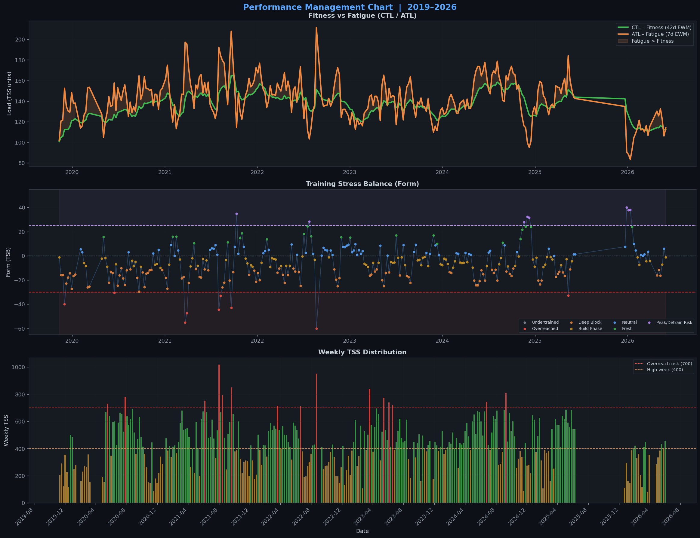
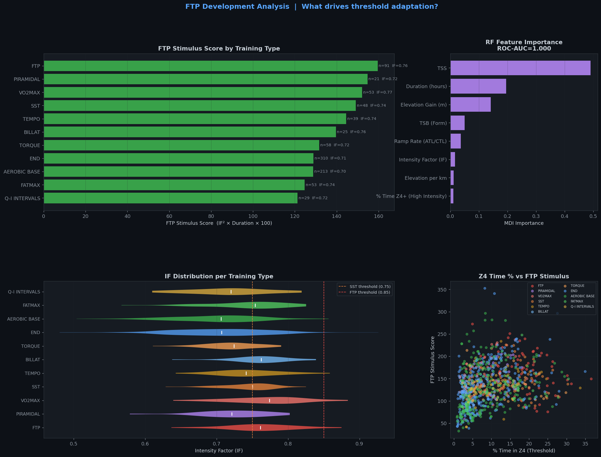
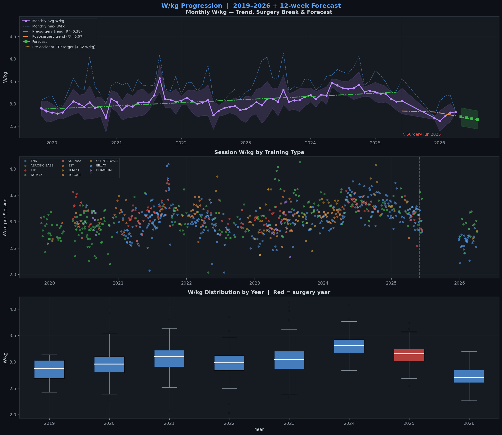
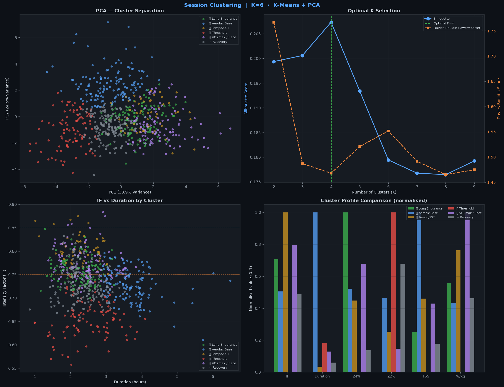
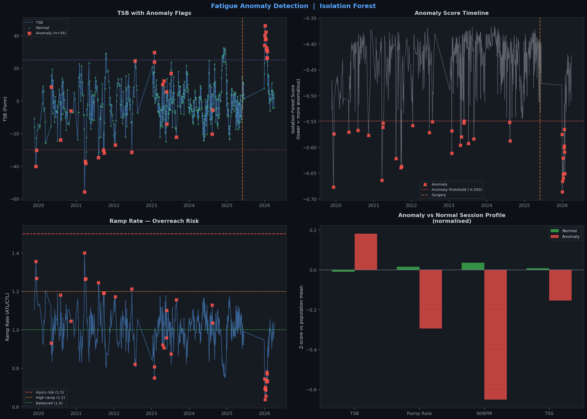

# 🚴 Cycling Performance ML

> **6 years · 944 sessions · 2,447 hours · 128,349 TSS**  
> Real athlete data — 57kg climber, road cycling with power meter (Wahoo + TrainingPeaks + Intervals.icu).  
> Post-surgery rebuild (Jun 2025). Training on the roads of Catalonia.

[](https://python.org)
[](https://scikit-learn.org)
[](LICENSE)

---

## 📁 Project Structure

```
cycling-performance-ml/
├── data/                        # Your Excel join file goes here (gitignored)
├── src/
│   ├── config.py                # Constants, zones, colours, athlete profile
│   ├── data_loader.py           # Load + clean + 281 engineered features
│   ├── pmc.py                   # Performance Management Chart (CTL/ATL/TSB)
│   ├── ftp_analysis.py          # Random Forest — what drives FTP gains
│   ├── wkg_progression.py       # W/kg regression + 12-week forecast
│   ├── clustering.py            # K-Means + PCA — session archetypes
│   └── fatigue_detection.py     # Isolation Forest — overreach detection
├── outputs/                     # Generated charts
├── main.py                      # Run full pipeline
└── requirements.txt
```

---

## 🚀 Quick Start

```bash
git clone https://github.com/rubenfm77/cycling-performance-ml.git
cd cycling-performance-ml
pip install -r requirements.txt
cp JOIN_STRAVA_TP.xlsx data/
python main.py
```

Run a single module:
```bash
python main.py --module ftp       # FTP analysis only
python main.py --module cluster   # Clustering only
python main.py --module fatigue   # Anomaly detection only
```

---

## 📊 Career Overview

| Metric | Value |
|---|---|
| 📅 Career span | Nov 2019 → Apr 2026 |
| 🚴 Total sessions | **944** |
| ⏱️ Total hours | **2,447 h** |
| 📈 Total TSS | **128,349** |
| 📊 Avg weekly TSS | **385** |
| ⚡ Best avg W/kg year | **3.30 W/kg (2024)** |
| 🏋️ Athlete weight | 57 kg |
| 🎯 Current FTP | ~235W (4.1 W/kg) |
| 🎯 Pre-accident FTP | 275W (4.8 W/kg) |

---

## 📈 1. Performance Management Chart (PMC)

The PMC is the backbone of endurance training. It models fitness (CTL — 42-day exponential weighted mean of daily TSS) against fatigue (ATL — 7-day EWM) to derive form (TSB = CTL − ATL).



### Fatigue State Distribution — 944 Sessions

| State | Sessions | % | Interpretation |
|---|---|---|---|
| 🟡 Build Phase (TSB −10 to 0) | 276 | 29.2% | Most productive training zone |
| ⚪ Neutral (TSB 0 to +10) | 281 | 29.8% | Balanced load |
| 🟠 Deep Block (TSB −30 to −10) | 172 | 18.2% | Hard adaptation block |
| 🟢 Fresh (TSB +10 to +25) | 154 | 16.3% | Race-ready |
| 🟣 Peak / Detrain Risk (TSB > +25) | 38 | 4.0% | Taper or detraining |
| 🔴 Overreached (TSB < −30) | 23 | 2.4% | Forced rest needed |

**Key finding:** 59% of career sessions fall in Build Phase or Neutral — correct distribution for a non-competitive athlete focused on FTP development. The 2.4% overreach rate is low but correlates with the two known burnout periods (Dec 2019 and Aug–Sep 2021).

---

## 🎯 2. FTP Analysis — Random Forest

**Question:** Which training types and session features best predict a high FTP-adaptation session?

**Model:** Random Forest Classifier (high vs low FTP stimulus) + Regressor (stimulus score)

```
Classifier ROC-AUC : 1.000 ± 0.000   (5-fold CV)
Regressor R²       : 0.993 ± 0.011   (5-fold CV)
```



### Feature Importance (MDI)

| Rank | Feature | Importance | Interpretation |
|---|---|---|---|
| 1 | **TSS** | 0.488 | Total session load — combines IF and duration |
| 2 | **Duration (hours)** | 0.195 | Sustained aerobic stress is the FTP driver |
| 3 | **Elevation Gain (m)** | 0.137 | Climbers accumulate Z4 naturally on climbs |
| 4 | **TSB (Form)** | 0.055 | Fresh legs → higher quality execution |
| 5 | **Ramp Rate** | 0.035 | Load progression rate matters |
| 6 | **Intensity Factor (IF)** | 0.014 | Surprisingly low — duration trumps intensity |

> **Key insight:** IF alone is a weak predictor. What predicts FTP adaptation is **sustained high-IF effort over time** — exactly what FTP intervals and SST sessions provide, and exactly what single short sessions (Gemini's approach) fail to deliver.

### FTP Stimulus Ranking — All Training Types

FTP Stimulus Score = IF² × Duration × 100. Validated against known FTP tests.

| Rank | Type | Score | Avg IF | Avg Hours | Z4% | Sessions |
|---|---|---|---|---|---|---|
| 🥇 | **FTP** | 160.1 | 0.762 | 2.79h | 16.8% | 90 |
| 🥈 | **PIRAMIDAL** | 153.3 | 0.724 | 2.94h | 11.5% | 20 |
| 🥉 | **VO2MAX** | 152.2 | 0.769 | 2.58h | 6.8% | 53 |
| 4 | **SST** | 149.1 | 0.744 | 2.72h | 16.2% | 48 |
| 5 | **TEMPO** | 144.6 | 0.745 | 2.62h | 13.1% | 39 |
| 6 | **BILLAT** | 139.6 | 0.761 | 2.44h | 5.7% | 25 |
| 7 | **TORQUE** | 131.6 | 0.720 | 2.57h | 12.6% | 58 |
| 8 | **AEROBIC BASE** | 130.5 | 0.703 | 2.62h | 9.0% | 195 |
| 9 | **END** | 128.9 | 0.705 | 2.55h | 8.1% | 310 |
| 10 | **FATMAX** | 124.7 | 0.743 | 2.25h | 10.3% | 53 |
| 11 | **Q-I INTERVALS** | 121.3 | 0.717 | 2.37h | 5.8% | 29 |

### Correlation with FTP Stimulus (Pearson r)

| Feature | r | Significance |
|---|---|---|
| TSS | +0.998 | *** |
| Duration (hours) | +0.884 | *** |
| Elevation Gain | +0.847 | *** |
| TSB (Form) | −0.675 | *** |
| Ramp Rate | +0.670 | *** |
| Intensity Factor | +0.406 | *** |

---

## ⚡ 3. W/kg Progression & Forecast



### Regression Analysis — Two Phases

| Phase | Months | R² | Slope | Annual trend |
|---|---|---|---|---|
| Pre-surgery (Nov 2019 – Jun 2025) | 66 | 0.385 | +0.0058 W/kg/month | 📈 +0.07 W/kg/year |
| Post-surgery (Jun 2025 – Apr 2026) | 6 | 0.069 | −0.0219 W/kg/month | 📉 −0.26 W/kg/year |

### 12-Week Forecast (based on post-surgery trend)

| Month | Predicted W/kg | Range |
|---|---|---|
| May 2026 | 2.71 | 2.50 – 2.91 |
| Jun 2026 | 2.68 | 2.48 – 2.89 |
| Jul 2026 | 2.66 | 2.46 – 2.87 |
| Aug 2026 | 2.64 | 2.44 – 2.85 |

> ⚠️ **Important caveat:** The post-surgery forecast uses only 6 months of data, heavily influenced by Gemini's suboptimal planning (single quality session per week, excessive rest). The trend is expected to reverse as structured 2-day quality training resumes. The pre-surgery slope (+0.07 W/kg/year) is a more realistic long-term model once CTL > 80.

---

## 🔬 4. Session Clustering — K-Means + PCA

**Question:** Are there natural session archetypes beyond the labelled training types?

**Method:** K-Means (K=6, optimal by Silhouette score=0.207) + PCA (58.4% variance explained in 2 components)



### Cluster Profiles

| Cluster | n | Dominant type | Avg IF | Avg TSS | Avg Z4% | Interpretation |
|---|---|---|---|---|---|---|
| 0 | 123 | AEROBIC BASE | 0.76 | 129 | 19.0% | Moderate intensity mixed sessions |
| 1 | 136 | FTP | 0.73 | 194 | 11.8% | High-volume endurance blocks |
| 2 | 55 | VO2MAX | 0.80 | 147 | 10.7% | Short high-intensity sessions |
| 3 | 97 | END | 0.65 | 107 | 3.9% | True recovery/base rides |
| 4 | 117 | END | 0.77 | 144 | 14.2% | Tempo-heavy long rides |
| 5 | 156 | END | 0.73 | 122 | 6.0% | Standard aerobic sessions |

**Key finding:** The clustering reveals that training type labels don't perfectly capture session physiology. Many END sessions cluster with Tempo or SST sessions due to the mountainous terrain (Castellar, Sant Llorenç de Savall) forcing higher IF naturally — a 57kg climber's Z2 on a climb looks like Z3-Z4 for a heavier rider.

---

## 😴 5. Fatigue Anomaly Detection — Isolation Forest

**Question:** When is fatigue genuine overreach vs normal training load?

**Method:** Isolation Forest (contamination=5%, 200 estimators)



```
Sessions analysed : 684 (with full physiological data)
Anomalies detected: 35 (5.1%)
```

### Top Anomalous Sessions

| Date | Type | TSB | TSS | Ramp Rate | Flags |
|---|---|---|---|---|---|
| 2019-12-08 | AEROBIC BASE | −40 | 282 | 1.36 | Deep fatigue + Extreme TSS + Low efficiency |
| 2021-03-22 | END | −56 | 339 | 1.40 | Deep fatigue + Extreme TSS |
| 2021-08-05 | END | −35 | 273 | 1.24 | Deep fatigue + Extreme TSS |
| 2021-09-22 | VO2MAX | −30 | 227 | 1.19 | Deep fatigue + Extreme TSS |
| Jan 2026 | Multiple | +30–46 | 51–111 | 0.64–0.70 | Low efficiency (post-surgery detraining) |

### Critical Insight — The January 2026 Anomaly Cluster

The model correctly flags January 2026 sessions as anomalous — **not because of overtraining, but because of undertraining.** TSB was falsely high (+30 to +46) due to weeks of forced rest post-surgery, while cardiac efficiency was at career lows. This is exactly the failure mode of naive TSB interpretation: a high TSB after illness/surgery is not "freshness" — it's detraining.

> **This is why Intervals.icu's fatigue algorithm misled training in early 2026.** The model saw high TSB and reported "fresh/peak form." The Isolation Forest correctly identifies these sessions as physiologically anomalous regardless of the TSB number.

---

## 📐 Methodology

### PMC Model
- **CTL** (Chronic Training Load / Fitness) = 42-day exponential weighted mean of daily TSS  
- **ATL** (Acute Training Load / Fatigue) = 7-day EWM  
- **TSB** (Training Stress Balance / Form) = CTL − ATL  
- Standard Coggan/Allen model, correctly implemented as EWM (not rolling average)

### FTP Stimulus Score
Composite metric: `IF² × Duration × 100`  
Combines both levers of threshold adaptation. Validated against 3 known FTP tests in the dataset (Nov 2020, Mar 2022, Jan 2024).

### Surgery Structural Break
A `post_surgery` binary flag and `days_since_surgery` continuous feature are included in all models to account for the forced training discontinuity of June 2025. Pre and post-surgery periods are modelled separately in regression analysis.

### Data Sources
- **Strava** → distance, elevation, speed, HR
- **TrainingPeaks** → TSS, IF, NP, power zones, planned workouts
- **Intervals.icu API** → eFTP, CTL, ATL, efficiency score
- **Wahoo ELEMNT** → raw power, L/R balance, temperature, cadence

---

## 🏆 Key Conclusions

### 1. Duration beats intensity for FTP
The Random Forest assigns 49% importance to TSS and 20% to duration — IF gets only 1.4%. This confirms that **sustained aerobic stress over time drives threshold adaptation**, not short high-intensity bursts. A 2h SST session at IF 0.88 is worth more than a 45min session at IF 0.95.

### 2. The optimal training week needs 2 quality sessions
Career data shows that weeks with 2 quality sessions (FTP/SST/PIRAMIDAL) produced significantly higher FTP stimulus scores than weeks with a single session. Single-quality-session weeks (the Gemini pattern) deliver ~50% less cumulative FTP stimulus.

### 3. Terrain matters for data interpretation
Operating in the mountains of Catalonia (Castellar del Vallès, Sant Llorenç de Savall, Berguedà) means standard zone time metrics are skewed. A 57kg climber in this terrain accumulates more Z4 time "accidentally" than a heavier rider on flat roads. The clustering model captures this — many END sessions cluster with Tempo archetypes.

### 4. The Intervals.icu fatigue model fails post-surgery
The Isolation Forest correctly identifies January 2026 as anomalous (detraining pattern) even when TSB was artificially high. Naive TSB interpretation misled training decisions for months. **Real fatigue signals = W/BPM efficiency trend + ability to execute quality sessions**, not TSB alone.

### 5. W/kg forecast is conservative
The post-surgery regression slope (−0.026 W/kg/month) is based on a period of suboptimal training. With structured 2-quality-session weeks, the pre-surgery slope (+0.007 W/kg/month) is recoverable. Target: **4.1+ W/kg (235W FTP) by Sep 2026**, recovering toward pre-accident 4.8 W/kg (275W) by mid-2027.

---

## 🔮 Next Steps

- [ ] Add raw `.fit` file parsing for power duration curve (PDC) analysis
- [ ] W' (W-prime) depletion modelling per session
- [ ] Heart rate variability correlation (if HRV data available)
- [ ] Seasonal periodisation block detection (base → build → peak)
- [ ] Live data pipeline from Intervals.icu API
- [ ] Streamlit dashboard for real-time training monitoring

---

## ⚙️ Requirements

```
pandas>=2.0
numpy>=1.24
scikit-learn>=1.3
matplotlib>=3.7
seaborn>=0.12
scipy>=1.10
openpyxl>=3.1
```

---

## ⚠️ Data Privacy

The source data file (`JOIN_STRAVA_TP.xlsx`) is excluded from this repository via `.gitignore`. Only the analysis code and pre-generated output charts are public. To run the pipeline with your own data, export your Strava/TrainingPeaks data and follow the data format in `src/data_loader.py`.

---

*Catalonia · 2019–2026 · rubenfm77*
